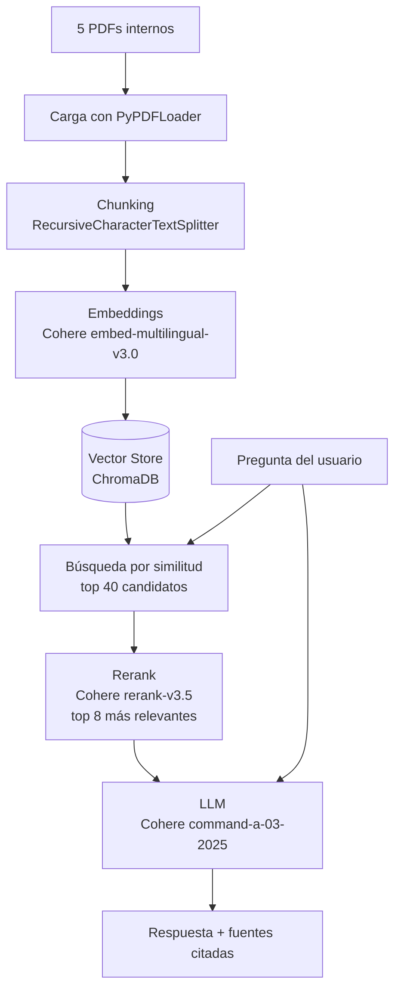
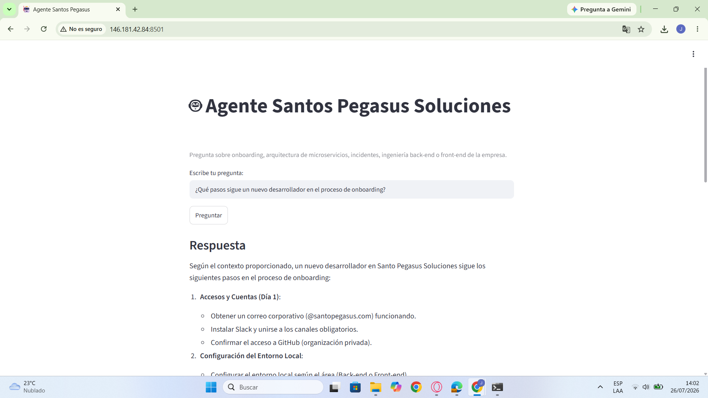

# 🤖 Agente Santos Pegasus Soluciones

Proyecto final del **Challenge Alura Agente** (Oracle Next Education). Un agente de inteligencia artificial que responde preguntas en lenguaje natural sobre la documentación interna de Santos Pegasus Soluciones (onboarding, arquitectura de microservicios, ingeniería back-end/front-end, e incidentes), usando una arquitectura RAG (Retrieval Augmented Generation).

## 📋 Descripción general

La empresa Santos Pegasus Soluciones cuenta con 5 documentos internos extensos (30-40 páginas cada uno). En vez de que las personas colaboradoras tengan que buscar manualmente dentro de cada PDF, este agente permite hacer preguntas directas y recibir respuestas basadas únicamente en el contenido real de esos documentos, citando la fuente exacta (archivo y página).

**Documentos utilizados:**
- Manual de Onboarding para Nuevos Desarrolladores
- Guía Oficial de Ingeniería Back-end
- Guía Oficial de Ingeniería Front-end
- Protocolo de Respuesta a Incidentes y Post-Mortems
- Arquitectura de Microservicios y Mapa de Dominios

## 🏗️ Arquitectura



**Por qué esta arquitectura:**
- **Chunking + embeddings + vector store:** con ~150-200 páginas en total, no es viable enviar todo el texto al modelo en cada pregunta. Se divide en fragmentos pequeños y se indexan semánticamente.
- **Rerank de dos etapas:** la búsqueda por embeddings sola no siempre encuentra el fragmento correcto cuando la pregunta está formulada de manera natural (sin palabras clave exactas del documento). Agregar un paso de reranking con Cohere Rerank mejora notablemente la precisión.
- **Prompt con instrucción anti-alucinación:** el modelo tiene instrucción explícita de decir "no lo sé" si la respuesta no está en el contexto recuperado, en vez de inventar información.

**Limitación conocida:** cuando la información relevante está repartida en varias secciones del documento (por ejemplo, una pregunta que toca tanto el stack tecnológico base como la configuración de observabilidad), el agente puede priorizar unas secciones sobre otras según cómo rankee cada chunk. Es un trade-off consciente de los sistemas RAG basados en similitud semántica, documentado aquí en vez de sobre-optimizado a costa de más llamadas de API.

## 🛠️ Tecnologías utilizadas

| Categoría | Herramienta |
|---|---|
| Lenguaje | Python 3.12 |
| Orquestación del agente | LangChain (LCEL) |
| Lectura de PDFs | PyPDF |
| Embeddings | Cohere `embed-multilingual-v3.0` |
| Vector store | ChromaDB |
| Reranking | Cohere `rerank-v3.5` |
| LLM | Cohere `command-a-03-2025` |
| Interfaz | Streamlit |
| Prototipado | Google Colab |
| Deploy | Oracle Cloud Infrastructure (OCI) Compute — Ubuntu 24.04, Always Free tier |

## 🚀 Instrucciones para ejecutar el proyecto

### Opción A: Prototipo en Google Colab

1. Abre `notebooks/santos_pegasus_agente_rag.ipynb` en [Google Colab](https://colab.research.google.com).
2. Consigue tu API key gratuita en [dashboard.cohere.com/api-keys](https://dashboard.cohere.com/api-keys).
3. Ejecuta las celdas en orden. La celda de carga de archivos te pedirá subir los 5 PDFs.

### Opción B: App web (Streamlit) en local

```bash
git clone https://github.com/winstonleon/santos-pegasus-agente.git
cd santos-pegasus-agente
python3 -m venv venv
source venv/bin/activate   # En Windows: venv\Scripts\activate
pip install -r requirements.txt
export COHERE_API_KEY="tu_api_key_aqui"
streamlit run app.py
```

> **Nota:** `app.py` espera encontrar una carpeta `chroma_db/` con la base vectorial ya generada (creada en el notebook de Colab). Genera la tuya siguiendo el notebook, o solicita el archivo `chroma_db.zip` de ejemplo.

## 💬 Ejemplos de preguntas y respuestas

**Pregunta:** ¿Qué tecnologías se usan en el back-end según la guía oficial de ingeniería backend?

**Respuesta del agente:**

Según la Guía Oficial de Ingeniería Back-end de Santo Pegasus Soluciones (versión 2.4.0), algunas de las tecnologías utilizadas en el back-end incluyen: Spring Boot Actuator y Micrometer para métricas, Prometheus como destino de exportación, Datadog para visualización y alerting, Spring Security con JWT/OAuth 2.0 para autenticación, mTLS para comunicación segura entre servicios, y HashiCorp Vault / AWS Secrets Manager / Google Cloud Secret Manager para gestión de secretos.

**Fuentes:** Guía Oficial de Ingeniería Back-end.pdf, Protocolo de Respuesta a Incidentes.pdf, Manual de Onboarding.pdf, Arquitectura de Microservicios.pdf

---

**Pregunta:** ¿Qué pasos sigue un nuevo desarrollador en el proceso de onboarding?

**Respuesta del agente:**

Según el contexto proporcionado, un nuevo desarrollador en Santo Pegasus Soluciones sigue los siguientes pasos:

1. **Accesos y Cuentas (Día 1):** correo corporativo, Slack, acceso a GitHub.
2. **Configuración del Entorno Local:** según el área (Back-end o Front-end).
3. **Guía de Git y Flujo de Trabajo:** familiarización con las prácticas de la empresa.
4. **Primeras Tareas Sugeridas (Plan 30/60/90 Días):** leer la Guía de Ingeniería correspondiente, resolver tickets `good-first-issue`, participar en Code Reviews como observador.
5. **Checklist de Onboarding (Semana 1):** sesión de bienvenida con el Tech Lead, presentación al squad, pair programming con el buddy, acuerdo del Plan 30/60/90, página personal en Confluence.
6. **Firma de Confirmación:** checklist firmado junto al Tech Lead y People Business Partner.
7. **Cultura y Conocimiento**, y **Contactos Útiles** (Tech Leads por área).

**Fuentes:** Manual de Onboarding para Nuevos Desarrolladores.pdf (páginas 0, 1, 19, 20, 27, 29, 33)

---

**Pregunta:** ¿Cuál es el protocolo a seguir ante un incidente de producción?

**Respuesta del agente:**

El protocolo se divide en varias fases:

1. **Detección:** alertas automáticas en `#incidents` (Datadog, PagerDuty).
2. **Declaración (T+0 a T+5 min):** el on-call publica el mensaje inicial; el Incident Commander (IC) asume el comando, declara la severidad, crea la War Room, asigna roles (Communications Lead, Technical Lead, SMEs) y abre el documento de timeline.
3. **War Room y Diagnóstico:** el Technical Lead y los SMEs identifican la causa raíz y definen la mitigación.
4. **Mitigación y Resolución:** se restaura el servicio.
5. **Comunicación a Stakeholders:** se informa del impacto y las acciones tomadas.
6. **Post-Mortem:** análisis posterior para documentar lecciones aprendidas y mejorar el protocolo.

**Fuentes:** Protocolo de Respuesta a Incidentes y Post-Mortems.pdf (páginas 1, 2, 3, 9, 10, 17, 34), Manual de Onboarding.pdf (página 22)

## ☁️ Evidencia del deploy en OCI

La aplicación está desplegada y corriendo en una instancia de OCI Compute (Ubuntu 24.04, Always Free tier):

🔗 **URL pública:** `http://146.181.42.84:8501/`



## 📁 Estructura del repositorio

```
santos-pegasus-agente/
├── app.py                  # App Streamlit para producción (deploy en OCI)
├── requirements.txt        # Dependencias de Python
├── README.md
├── .gitignore
├── notebooks/
│   └── santos_pegasus_agente_rag.ipynb   # Prototipo y desarrollo en Colab
└── docs/
    └── evidencia-deploy.png              # Captura de pantalla del deploy
```

## 📝 Contexto

Proyecto desarrollado como parte del **Challenge Alura Agente**, del programa **Oracle Next Education (ONE)**.
